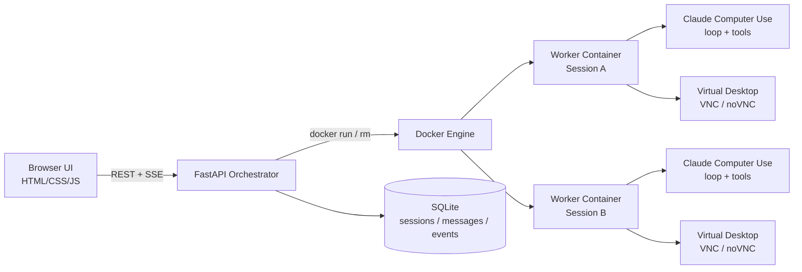

# Claude Computer Use Session Orchestrator

<!-- Add a GitHub Actions CI badge here after the repository and workflow URL are public/stable. -->

A production-style FastAPI orchestration prototype for running isolated Claude
Computer Use sessions as backend workloads. It creates one Dockerized desktop
worker per session, streams real-time agent events through SSE, exposes the
worker desktop through noVNC, and persists session history in SQLite for
debugging and demos.

This is a personal AI infrastructure project focused on backend engineering
quality: lifecycle management, reliable cleanup, config validation, local
security boundaries, observability, and testable failure paths. It is not a
hardened SaaS platform.

## Project Status

Current status: working local production-style prototype.

What works today:

- FastAPI orchestrator for session, message, history, health, and readiness APIs.
- One Docker worker container per session.
- Real Claude Computer Use execution inside each worker.
- Server-Sent Events for real-time agent events.
- noVNC desktop access for observing worker sessions.
- SQLite-backed session history.
- Focused portfolio test suite for orchestrator/backend behavior.

Known limitations:

- Docker socket access is a local trust boundary and should not be exposed.
- SQLite persistence is local-first and not designed for multi-user production.
- Full restart recovery and worker reattachment are not implemented.
- Production auth is off by default unless `ORCHESTRATOR_API_TOKEN` is set.

Next planned improvements:

- Stronger security hardening around worker launch and exposed local ports.
- Worker lifecycle recovery after orchestrator restart.
- Richer observability, logging, and optional metrics.
- CI/deployment polish for reproducible demos.
- More polished frontend timeline states and screenshots/GIF assets.

## Architecture



Text fallback:

```text
HTML/JS frontend
  -> FastAPI orchestrator
  -> one Docker worker per session
  -> Claude Computer Use loop/tools
  -> SSE events + noVNC desktop
  -> SQLite session history
```

## Engineering Highlights

- Session-oriented FastAPI API for create/get/delete/message/history flows.
- One isolated desktop worker container per session.
- Real-time Server-Sent Events proxying and persistence.
- noVNC access to observe the virtual desktop while the agent works.
- SQLite-backed session, message, status, error, and event history.
- Config module with validation for tokens, worker image, limits, timeouts, and CORS.
- Worker CPU, memory, and PID limits for safer local demos.
- Label-scoped worker cleanup to avoid deleting unrelated containers.
- Optional bearer token protection for session-scoped orchestrator endpoints.
- Optional VNC password support while preserving the passwordless local demo.
- Structured local-dev logs for startup, worker lifecycle, SSE, task duration, and failures.
- Focused tests with mocked worker and Anthropic behavior.

## Tradeoffs

- SQLite is intentionally used for a local/demo persistence layer. PostgreSQL
  would be the natural next step for multi-user or long-running deployments.
- Docker socket access keeps the prototype simple, but it is a serious trust
  boundary. This should stay local or be replaced by a narrower worker launcher.
- Worker lifecycle is routed through a `WorkerLauncher` abstraction. The only
  implemented launcher is `local_docker`, which preserves the current local
  Docker behavior.
- The frontend is dependency-free HTML/CSS/JS to keep the backend architecture
  easy to inspect. It is a demo console, not a full product UI.
- Worker reattachment after orchestrator restart is documented as a future
  improvement. Current in-memory session state is paired with persisted history.
- API token auth is deliberately simple. Local users, organizations, and
  ownership checks exist for SaaS shape, but there are no OAuth flows, roles, or
  production account-management features yet.

## Security Model

Default mode is trusted local development:

- The orchestrator and frontend are intended to run on localhost.
- Worker ports are bound to `127.0.0.1`.
- `.env`, databases, logs, caches, and local artifacts are ignored by git.
- `/healthz`, `/readyz`, and `/docs` remain public for local diagnostics.
- Session-scoped data is owned by a local development user and organization.
- If `ORCHESTRATOR_API_TOKEN` is set, session-scoped endpoints require:

```http
Authorization: Bearer your_token
```

Protected endpoints include session create/get/delete, messages, history, UI,
and SSE streams. The static frontend does not inject tokens; keep the token
unset for the simplest browser demo or use an API client for protected mode.

### Local Development Identity

The API includes a small local auth adapter so the prototype is multi-user in
shape without adding a production auth provider yet. Session-scoped endpoints
resolve identity from request headers:

```http
X-User-Id: dev-user
X-Org-Id: dev-org
```

If those headers are absent, the API falls back to `DEV_USER_ID` and
`DEV_ORG_ID`, which default to `dev-user` and `dev-org`. This preserves the
current browser demo: the static frontend can create sessions, stream SSE, open
noVNC, and load history without manually setting headers.

Sessions are stored with `user_id` and `organization_id`. Reads, message sends,
SSE streams, history, UI pages, and deletes require the current local identity
to match the session owner. Cross-owner access returns `404`.

This is not production authentication. The future SaaS path is to replace this
adapter with a real authenticated principal from an auth provider or OIDC layer,
then keep the same ownership checks behind that dependency.

### SaaS Safety Limits

The orchestrator now has lightweight SaaS-style lifecycle controls around the
existing one-worker-per-session flow. These controls are enforced server-side
and do not require any frontend changes.

- New sessions are rejected when the current user or organization reaches its
  active concurrent session limit.
- New sessions and messages are rejected when `PLATFORM_DISABLE_NEW_SESSIONS`
  or `GLOBAL_KILL_SWITCH` is enabled.
- Organizations listed in `ORG_DISABLE_NEW_SESSIONS` cannot create sessions or
  send new messages.
- Messages are rejected when the session is busy, expired, deleted, killed,
  failed, over runtime, or over message quota.
- Runtime and idle expiration stop the active worker, persist a final event,
  and keep session history instead of silently deleting it.
- Event persistence is capped by `MAX_EVENTS_PER_SESSION`; live SSE still flows
  to the browser, but excess events are not stored in SQLite.

These are quota and safety controls, not billing. A future billing phase should
add a separate cost ledger and provider usage reconciliation.

### Protected noVNC UI Access

Session creation returns `ui_url` and `novnc_url` values that point at the
orchestrator-owned `/sessions/{id}/ui` wrapper instead of making the frontend
depend only on the raw worker noVNC port. In local demo mode this wrapper uses
the same local development identity fallback as the rest of the API, so the
browser demo still works without extra setup.

For a more SaaS-shaped access flow, enable:

```bash
export PROTECT_SESSION_UI=true
export UI_TOKEN_SECRET="replace-with-a-random-secret"
```

Then callers should request:

```http
POST /sessions/{id}/ui-token
```

The endpoint is bearer-token protected when `ORCHESTRATOR_API_TOKEN` is set and
always ownership-checked with the local identity adapter. It returns a temporary
URL such as:

```text
/sessions/{id}/ui?token=...
```

The signed token contains `session_id`, `user_id`, `organization_id`, and an
expiration timestamp. The static frontend requests this token automatically
before opening the noVNC button, so protected mode does not require a frontend
rewrite.

Manual protected-mode check:

```bash
export PROTECT_SESSION_UI=true
export UI_TOKEN_SECRET="dev-random-secret"
make run-api
```

Then run the web frontend, click `Clear local`, create a session, and click
`Open noVNC`. The API log should show `POST /sessions/{id}/ui-token` followed
by `GET /sessions/{id}/ui?token=...`. A direct `GET /sessions/{id}/ui` without
the token should return `403`.

This is not a full noVNC reverse proxy. The worker noVNC port is still bound
locally and embedded by the checked UI page. A later production hardening phase
should proxy noVNC traffic through the orchestrator or an authenticated edge
component so raw worker ports are never directly reachable.

### Worker Launcher Boundary

`WORKER_LAUNCHER=local_docker` is the current and default worker launcher. It
keeps the existing one-Docker-container-per-session behavior, including local
port allocation, project labels, CPU/memory/PID limits, readiness checks,
orphan cleanup, SSE URLs, message URLs, and noVNC metadata.

This launcher is appropriate for local development and prototype demos because
it uses the local Docker engine directly. A production SaaS should eventually
move worker creation behind a narrower internal or remote launcher so the
FastAPI app does not need direct Docker socket access.

Future launcher names are roadmap placeholders only and are not implemented:
`ecs_fargate`, `fly_machines`, `remote_launcher`, and `kubernetes`.

### Observability Baseline

Every HTTP response includes an `X-Request-Id` header. If the client sends
`X-Request-Id`, the orchestrator echoes it; otherwise it generates a UUID.
Request logs include the request ID, method, path, status, and duration. Query
strings are intentionally omitted from request logs so signed UI tokens are not
written to logs.

Logs use normal text formatting by default. Set `LOG_FORMAT=json` to emit one
JSON object per line for easier ingestion by a future log collector:

```bash
export LOG_FORMAT=json
```

Readiness and lightweight operational visibility are exposed through:

```http
GET /readyz
GET /metrics
GET /admin/sessions
```

`/readyz` reports safe configuration and dependency state: database reachability,
configured worker launcher, worker image name, auth mode, and protected UI mode.
It does not expose API keys, UI token secrets, or bearer tokens.

`/metrics` returns a small JSON snapshot for local demos and smoke checks:
active sessions, sessions created, failed sessions, active workers, worker start
failures, messages, quota events, expiration events, launcher type, protected UI
state, and global kill switch state.

`/admin/sessions` returns active session and worker summaries without message
contents or secrets. It is protected by `ORCHESTRATOR_API_TOKEN` when that token
is configured. Production deployments should replace this with real admin auth
before exposing it beyond a trusted network.

See [SECURITY.md](SECURITY.md) for the Docker socket risk, noVNC/VNC assumptions,
and future hardening options.

## Expected Event Examples

The worker emits SSE events that the orchestrator proxies and stores.

ASSISTANT_BLOCK:

```text
event: assistant_block
data: {"type":"text","text":"I will open the browser and search for the weather."}
```

TOOL_USE_START:

```text
event: tool_use_start
data: {"id":"toolu_123","name":"computer","input":{"action":"screenshot"}}
```

TOOL_RESULT:

```text
event: tool_result
data: {"tool_use_id":"toolu_123","is_error":false,"output":"Opened Firefox."}
```

SCREENSHOT:

```text
event: screenshot
data: {"tool_use_id":"toolu_123","image_base64":"..."}
```

DONE:

```text
event: done
data: {"ok":true}
```

## Quick Start

```bash
python3 -m venv .venv
source .venv/bin/activate
pip install -r requirements.txt
pip install -r dev-requirements.txt

export ANTHROPIC_API_KEY="your_anthropic_api_key"
make build-worker
make run-api
```

In another terminal:

```bash
make run-web
```

Open:

```text
http://127.0.0.1:5173
```

## Configuration Reference

Runtime configuration is centralized in `computer_use_demo/api/config.py`.

| Variable | Default | Purpose |
| --- | --- | --- |
| `ANTHROPIC_API_KEY` | empty | Required to run real Claude Computer Use tasks. |
| `ORCHESTRATOR_API_TOKEN` | empty | Optional bearer token for session-scoped API endpoints. |
| `DEV_USER_ID` | `dev-user` | Local auth adapter fallback user when `X-User-Id` is absent. |
| `DEV_ORG_ID` | `dev-org` | Local auth adapter fallback organization when `X-Org-Id` is absent. |
| `MAX_CONCURRENT_SESSIONS_PER_USER` | `10` | Active in-memory session limit for one local dev/SaaS user. |
| `MAX_CONCURRENT_SESSIONS_PER_ORG` | `50` | Active in-memory session limit for one organization. |
| `MAX_SESSION_RUNTIME_SECONDS` | `3600` | Hard runtime cap before a session is expired and its worker is stopped. |
| `MAX_IDLE_SESSION_SECONDS` | `1800` | Idle cap before a non-busy session is expired and its worker is stopped. |
| `MAX_MESSAGES_PER_SESSION` | `100` | Maximum user messages accepted for one session. |
| `MAX_EVENTS_PER_SESSION` | `5000` | Maximum worker events persisted for one session. |
| `PLATFORM_DISABLE_NEW_SESSIONS` | `false` | Reject new sessions and new messages without stopping existing workers. |
| `GLOBAL_KILL_SWITCH` | `false` | Reject new sessions and new messages as a platform-wide emergency switch. |
| `ORG_DISABLE_NEW_SESSIONS` | empty | Comma-separated organization IDs blocked from new sessions/messages. |
| `PROTECT_SESSION_UI` | `false` | Require signed temporary tokens for `/sessions/{id}/ui` browser access. |
| `UI_TOKEN_SECRET` | empty | HMAC secret for UI access tokens; falls back to a derivation of `ORCHESTRATOR_API_TOKEN` when available. |
| `UI_TOKEN_TTL_SECONDS` | `300` | Lifetime for signed UI access tokens. |
| `COMPUTER_USE_DB_PATH` | `data/orchestrator.db` | SQLite database path. |
| `WORKER_LAUNCHER` | `local_docker` | Worker lifecycle backend. Only `local_docker` is implemented; future values are roadmap placeholders. |
| `PUBLIC_HOST` | `127.0.0.1` | Host used when returning frontend/noVNC URLs. |
| `WORKER_CONNECT_HOST` | `127.0.0.1` | Host the orchestrator uses to call worker HTTP APIs. |
| `WORKER_IMAGE` | `computer-use-demo:local` | Docker image used for workers. |
| `MODEL` | `claude-sonnet-4-5-20250929` | Claude model passed to workers. |
| `TOOL_VERSION` | `computer_use_20250124` | Anthropic Computer Use tool version. |
| `MAX_TOKENS` | `4096` | Maximum Claude response tokens. |
| `ENABLE_STREAMLIT` | `false` | Enables the legacy/debug Streamlit UI inside workers. |
| `VNC_PASSWORD` | empty | Optional VNC password for worker desktop access. |
| `LOG_LEVEL` | `INFO` | Python logging level. |
| `LOG_FORMAT` | `text` | Log output format. Use `json` for single-line structured logs. |
| `CORS_ALLOWED_ORIGINS` | localhost frontend origins | Comma-separated CORS allowlist. |
| `CLEANUP_ORPHAN_WORKERS_ON_STARTUP` | `false` | Remove project-labeled workers at startup. |
| `SESSION_TTL_SECONDS` | `300` | Legacy idle fallback used only when `MAX_IDLE_SESSION_SECONDS` is unset. |
| `CLEANUP_EVERY_SECONDS` | `30` | Background session cleanup interval. |
| `WORKER_READY_TIMEOUT_SECONDS` | `25.0` | Worker readiness timeout. |
| `WORKER_READY_POLL_SECONDS` | `0.5` | Worker readiness polling interval. |
| `WORKER_STATUS_POLL_SECONDS` | `2.0` | Worker task status polling interval. |
| `SSE_RETRY_LIMIT` | `3` | Worker SSE reconnect attempts before surfacing an error. |
| `SSE_RETRY_INITIAL_BACKOFF_SECONDS` | `0.25` | Initial worker SSE reconnect backoff. |
| `SSE_RETRY_MAX_BACKOFF_SECONDS` | `3.0` | Maximum worker SSE reconnect backoff. |
| `WORKER_CPU_LIMIT` | `1.0` | `docker run --cpus` value for each worker. |
| `WORKER_MEMORY_LIMIT` | `2g` | `docker run --memory` value for each worker. |
| `WORKER_PIDS_LIMIT` | `512` | `docker run --pids-limit` value for each worker. |

## API Overview

```http
POST   /sessions
GET    /sessions/{id}
DELETE /sessions/{id}

POST   /sessions/{id}/messages
GET    /sessions/{id}/events
GET    /sessions/{id}/history

GET    /healthz
GET    /readyz
GET    /metrics
GET    /admin/sessions
```

`/healthz`, `/readyz`, `/metrics`, and `/docs` are public local diagnostics.
`/admin/sessions` is bearer-token protected when `ORCHESTRATOR_API_TOKEN` is
configured. Session-scoped endpoints are protected when the token is configured
and always enforce local development ownership with `X-User-Id` / `X-Org-Id` or
the `DEV_USER_ID` / `DEV_ORG_ID` fallbacks.

## Development Commands

```bash
make install        # Create .venv and install runtime/dev dependencies
make test           # Run the default orchestrator/backend test suite
make test-project   # Run the same focused project tests explicitly
make test-legacy    # Run legacy upstream Anthropic/Streamlit/tool tests
make test-all       # Run project tests, then legacy tests
make smoke-local    # Check API health/readiness and frontend HTML
make build-worker   # Build the per-session worker image
make run-api        # Start the FastAPI orchestrator on 127.0.0.1:9000
make run-web        # Serve the static frontend on 127.0.0.1:5173
make clean-workers  # Remove Docker workers labeled cambioml=orchestrator
make clean-local    # Remove local test/lint/cache artifacts
```

## Testing

The default test command is intentionally focused on this repository's
orchestrator/backend behavior:

```bash
make test
# equivalent to:
python3 -B -m pytest -q
```

Pytest is configured to collect `tests/test_*.py`, which keeps the portfolio CI
suite centered on the FastAPI orchestrator, SQLite persistence, worker manager,
SSE formatting, config validation, and security/reliability paths.

The repository also contains legacy upstream Anthropic Computer Use tests:

- `tests/loop_test.py`
- `tests/streamlit_test.py`
- `tests/tools/*`

Those tests are useful when working on the vendored Computer Use demo internals,
but they require optional upstream dependencies such as `anthropic` and
`streamlit`. They are excluded from default collection so a clean local clone can
verify the orchestration project without installing the full upstream demo stack.
Run them explicitly with:

```bash
make test-legacy
```

To run both suites in order:

```bash
make test-all
```

## 5-Minute Demo Script

1. Show the architecture diagram and explain one worker container per session.
2. Run `make test` to show the focused orchestrator/backend test suite.
3. Start Docker, then run `make build-worker`.
4. Start the API with `make run-api` and the frontend with `make run-web`.
5. Open `http://127.0.0.1:5173`.
6. Create Session A and open noVNC.
7. Send: `Open Firefox and search for the current weather in Tokyo.`
8. Point out `assistant_block`, `tool_use_start`, `tool_result`, `screenshot`,
   and `done` events in the timeline.
9. Create Session B and send a different task to show isolation.
10. Refresh the frontend and load `History`.
11. Delete a session and show worker cleanup logs.

During a local demo, keep an eye on:

- `X-Request-Id` in browser/API responses when tracing a specific action.
- `/readyz` before the demo starts to confirm SQLite and launcher config.
- `/metrics` after creating and deleting sessions to confirm active session and
  worker counts move as expected.
- `/admin/sessions` while a session is active to confirm worker metadata without
  exposing message contents.
- API logs for lifecycle events such as startup, worker creation, expiration,
  quota rejection, session delete, and worker cleanup.

## Screenshots And GIFs

Recommended portfolio assets:

- `docs/assets/frontend-session-timeline.png`
- `docs/assets/novnc-worker-desktop.png`
- `docs/assets/two-session-demo.gif`

Do not include API keys, `.env` contents, real customer data, private challenge
text, reviewer names, or browser tabs with personal information.

## Known Limitations

- SQLite is used for local/demo persistence.
- Active worker reattachment after orchestrator restart is not fully implemented.
- Docker socket access is powerful and should stay in trusted local environments.
- VNC/noVNC is local-first and not intended for public exposure.
- The frontend is a dependency-free demo console, not a polished SaaS UI.
- API token auth is intentionally simple and not a user/account system.
- `/metrics` is a lightweight JSON snapshot, not a Prometheus-compatible scrape
  endpoint.
- `/admin/sessions` is for trusted local/internal debugging and does not include
  roles, audit trails, or production admin authorization.

## Future Roadmap

- Security hardening around Docker socket access, VNC/noVNC exposure, and local
  token handling.
- Reattach or reconcile active workers after orchestrator restart.
- Add migrations and PostgreSQL option for longer-running deployments.
- Add a worker-launch sidecar or Docker API proxy to reduce socket exposure.
- Add richer event timeline with screenshot thumbnails and task duration.
- Add WebSocket streaming alternative for clients that prefer bidirectional flows.
- Add Prometheus/OpenTelemetry-compatible metrics and tracing behind a production
  deployment profile.
- Add deployment notes for a safer single-host demo environment.
- Add portfolio screenshots and a short two-session GIF.
- Add packaging for reproducible demo releases.

## Additional Docs

- [Architecture](docs/ARCHITECTURE.md)
- [Operations](docs/OPERATIONS.md)
- [Demo Guide](docs/DEMO.md)
- [Security Notes](SECURITY.md)
