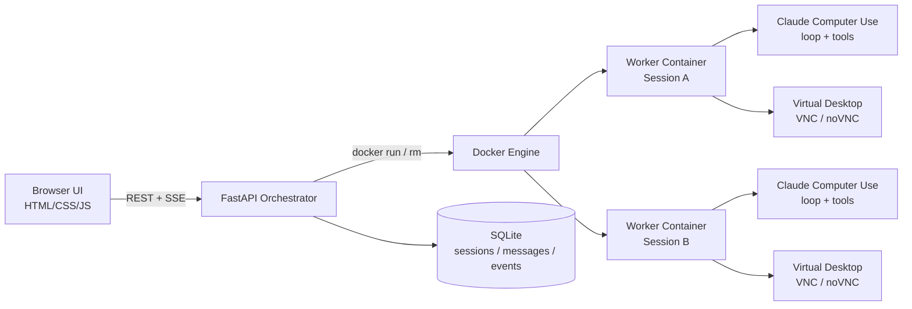

# Claude Computer Use Session Orchestrator

[](https://github.com/duvi18/computer-use-orchestrator/actions/workflows/ci.yml)

A production-style FastAPI orchestration prototype for running isolated Claude
Computer Use sessions as backend workloads. It creates one Dockerized desktop
worker per session, streams real-time agent events through SSE, exposes the
worker desktop through noVNC, and persists session history in SQLite for
debugging and demos.

This is a personal AI infrastructure project focused on backend engineering
quality: lifecycle management, reliable cleanup, config validation, local
security boundaries, observability, and testable failure paths. It is not a
hardened SaaS platform.

## Architecture



Text fallback:

```text
HTML/JS frontend
  -> FastAPI orchestrator
  -> one Docker worker per session
  -> Claude Computer Use loop/tools
  -> SSE events + noVNC desktop
  -> SQLite session history
```

## Engineering Highlights

- Session-oriented FastAPI API for create/get/delete/message/history flows.
- One isolated desktop worker container per session.
- Real-time Server-Sent Events proxying and persistence.
- noVNC access to observe the virtual desktop while the agent works.
- SQLite-backed session, message, status, error, and event history.
- Config module with validation for tokens, worker image, limits, timeouts, and CORS.
- Worker CPU, memory, and PID limits for safer local demos.
- Label-scoped worker cleanup to avoid deleting unrelated containers.
- Optional bearer token protection for session-scoped orchestrator endpoints.
- Optional VNC password support while preserving the passwordless local demo.
- Structured local-dev logs for startup, worker lifecycle, SSE, task duration, and failures.
- Focused tests with mocked worker and Anthropic behavior.

## Tradeoffs

- SQLite is intentionally used for a local/demo persistence layer. PostgreSQL
  would be the natural next step for multi-user or long-running deployments.
- Docker socket access keeps the prototype simple, but it is a serious trust
  boundary. This should stay local or be replaced by a narrower worker launcher.
- The frontend is dependency-free HTML/CSS/JS to keep the backend architecture
  easy to inspect. It is a demo console, not a full product UI.
- Worker reattachment after orchestrator restart is documented as a future
  improvement. Current in-memory session state is paired with persisted history.
- API token auth is deliberately simple. There are no accounts, OAuth, roles, or
  multi-tenant ownership checks.

## Security Model

Default mode is trusted local development:

- The orchestrator and frontend are intended to run on localhost.
- Worker ports are bound to `127.0.0.1`.
- `.env`, databases, logs, caches, and local artifacts are ignored by git.
- `/healthz`, `/readyz`, and `/docs` remain public for local diagnostics.
- If `ORCHESTRATOR_API_TOKEN` is set, session-scoped endpoints require:

```http
Authorization: Bearer your_token
```

Protected endpoints include session create/get/delete, messages, history, UI,
and SSE streams. The static frontend does not inject tokens; keep the token
unset for the simplest browser demo or use an API client for protected mode.

See [SECURITY.md](SECURITY.md) for the Docker socket risk, noVNC/VNC assumptions,
and future hardening options.

## Expected Event Examples

The worker emits SSE events that the orchestrator proxies and stores.

ASSISTANT_BLOCK:

```text
event: assistant_block
data: {"type":"text","text":"I will open the browser and search for the weather."}
```

TOOL_USE_START:

```text
event: tool_use_start
data: {"id":"toolu_123","name":"computer","input":{"action":"screenshot"}}
```

TOOL_RESULT:

```text
event: tool_result
data: {"tool_use_id":"toolu_123","is_error":false,"output":"Opened Firefox."}
```

SCREENSHOT:

```text
event: screenshot
data: {"tool_use_id":"toolu_123","image_base64":"..."}
```

DONE:

```text
event: done
data: {"ok":true}
```

## Quick Start

```bash
python3 -m venv .venv
source .venv/bin/activate
pip install -r requirements.txt
pip install -r dev-requirements.txt

export ANTHROPIC_API_KEY="your_anthropic_api_key"
make build-worker
make run-api
```

In another terminal:

```bash
make run-web
```

Open:

```text
http://127.0.0.1:5173
```

## Configuration Reference

Runtime configuration is centralized in `computer_use_demo/api/config.py`.

| Variable | Default | Purpose |
| --- | --- | --- |
| `ANTHROPIC_API_KEY` | empty | Required to run real Claude Computer Use tasks. |
| `ORCHESTRATOR_API_TOKEN` | empty | Optional bearer token for session-scoped API endpoints. |
| `COMPUTER_USE_DB_PATH` | `data/orchestrator.db` | SQLite database path. |
| `PUBLIC_HOST` | `127.0.0.1` | Host used when returning frontend/noVNC URLs. |
| `WORKER_CONNECT_HOST` | `127.0.0.1` | Host the orchestrator uses to call worker HTTP APIs. |
| `WORKER_IMAGE` | `computer-use-demo:local` | Docker image used for workers. |
| `MODEL` | `claude-sonnet-4-5-20250929` | Claude model passed to workers. |
| `TOOL_VERSION` | `computer_use_20250124` | Anthropic Computer Use tool version. |
| `MAX_TOKENS` | `4096` | Maximum Claude response tokens. |
| `ENABLE_STREAMLIT` | `false` | Enables the legacy/debug Streamlit UI inside workers. |
| `VNC_PASSWORD` | empty | Optional VNC password for worker desktop access. |
| `LOG_LEVEL` | `INFO` | Python logging level. |
| `CORS_ALLOWED_ORIGINS` | localhost frontend origins | Comma-separated CORS allowlist. |
| `CLEANUP_ORPHAN_WORKERS_ON_STARTUP` | `false` | Remove project-labeled workers at startup. |
| `SESSION_TTL_SECONDS` | `300` | Idle session cleanup threshold. |
| `WORKER_READY_TIMEOUT_SECONDS` | `25.0` | Worker readiness timeout. |
| `SSE_RETRY_LIMIT` | `3` | Worker SSE reconnect attempts before surfacing an error. |
| `WORKER_CPU_LIMIT` | `1.0` | `docker run --cpus` value for each worker. |
| `WORKER_MEMORY_LIMIT` | `2g` | `docker run --memory` value for each worker. |
| `WORKER_PIDS_LIMIT` | `512` | `docker run --pids-limit` value for each worker. |

## API Overview

```http
POST   /sessions
GET    /sessions/{id}
DELETE /sessions/{id}

POST   /sessions/{id}/messages
GET    /sessions/{id}/events
GET    /sessions/{id}/history

GET    /healthz
GET    /readyz
```

`/healthz`, `/readyz`, and `/docs` are public local diagnostics. Session-scoped
endpoints are protected when `ORCHESTRATOR_API_TOKEN` is configured.

## Development Commands

```bash
make install        # Create .venv and install runtime/dev dependencies
make test           # Run focused unit tests
make smoke-local    # Check API health/readiness and frontend HTML
make build-worker   # Build the per-session worker image
make run-api        # Start the FastAPI orchestrator on 127.0.0.1:9000
make run-web        # Serve the static frontend on 127.0.0.1:5173
make clean-workers  # Remove Docker workers labeled cambioml=orchestrator
make clean-local    # Remove local test/lint/cache artifacts
```

## 5-Minute Demo Script

1. Show the architecture diagram and explain one worker container per session.
2. Run `make test` to show the focused test suite.
3. Start Docker, then run `make build-worker`.
4. Start the API with `make run-api` and the frontend with `make run-web`.
5. Open `http://127.0.0.1:5173`.
6. Create Session A and open noVNC.
7. Send: `Open Firefox and search for the current weather in Tokyo.`
8. Point out `assistant_block`, `tool_use_start`, `tool_result`, `screenshot`,
   and `done` events in the timeline.
9. Create Session B and send a different task to show isolation.
10. Refresh the frontend and load `History`.
11. Delete a session and show worker cleanup logs.

## Screenshots And GIFs

Recommended portfolio assets:

- `docs/assets/frontend-session-timeline.png`
- `docs/assets/novnc-worker-desktop.png`
- `docs/assets/two-session-demo.gif`

Do not include API keys, `.env` contents, real customer data, private challenge
text, reviewer names, or browser tabs with personal information.

## Known Limitations

- SQLite is used for local/demo persistence.
- Active worker reattachment after orchestrator restart is not fully implemented.
- Docker socket access is powerful and should stay in trusted local environments.
- VNC/noVNC is local-first and not intended for public exposure.
- The frontend is a dependency-free demo console, not a polished SaaS UI.
- API token auth is intentionally simple and not a user/account system.

## Future Roadmap

- Reattach or reconcile active workers after orchestrator restart.
- Add migrations and PostgreSQL option for longer-running deployments.
- Add a worker-launch sidecar or Docker API proxy to reduce socket exposure.
- Add richer event timeline with screenshot thumbnails and task duration.
- Add WebSocket streaming alternative for clients that prefer bidirectional flows.
- Add structured metrics/tracing behind an optional local flag.
- Add packaging for reproducible demo releases.

## Additional Docs

- [Architecture](docs/ARCHITECTURE.md)
- [Operations](docs/OPERATIONS.md)
- [Demo Guide](docs/DEMO.md)
- [Security Notes](SECURITY.md)
