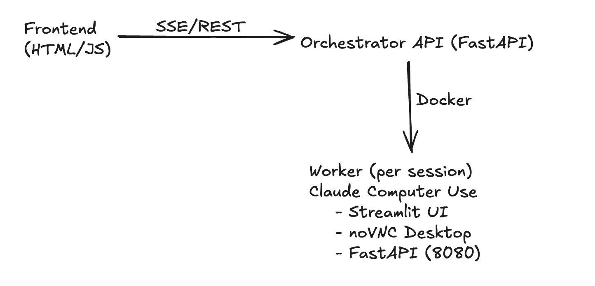

# CambioML Coding Challenge

## Backend / Orchestrator – Claude Computer Use

Author: Duvan Mendoza
Role: Backend Engineer
Stack: Python, FastAPI, Docker, SSE, SQLite

## 1. Overview
This project extends the official Anthropic Computer Use Demo by adding a production-style orchestrator responsible for:

- Managing multiple concurrent user sessions
- Spawning isolated Claude Computer Use workers (Docker containers)
- Streaming events to clients using Server-Sent Events (SSE)
- Persisting session state, messages, and events
- Demonstrating concurrency, isolation, and cleanup guarantees

The goal is to show how a real-world backend service could safely expose Claude’s Computer Use capability to multiple users simultaneously.

## 2. High-Level Architecture

### Key properties

- One worker container per session
- No shared state between users
- Orchestrator is stateless aside from SQLite persistence
- Workers can be horizontally scaled

## 3. Orchestrator Responsibilities

The orchestrator (FastAPI):

- Creates and tracks sessions
- Starts and stops worker containers
- Proxies messages and SSE streams
- Enforces one active task per session
- Cleans up idle sessions using TTL
- Persists data to SQLite

### Why SSE instead of WebSockets?
- Works over plain HTTP
- Simple reconnection semantics
- Native browser support (EventSource)
- Easy replay using Last-Event-ID

## 4. Persistence (SQLite)

SQLite is used to persist:

- sessions
- messages
- events

This allows:

- Debugging
- Replay after restart
- Simple production-ready persistence without external dependencies

Database is initialized automatically on startup.

## 5. API Endpoints
### Session lifecycle

POST   /sessions
GET    /sessions/{id}
DELETE /sessions/{id}

### Messaging

POST /sessions/{id}/messages

### Event streaming (SSE)

GET /sessions/{id}/events

### Combined UI (Streamlit + noVNC)

GET /sessions/{id}/ui

## 6. SSE Event Stream

### Endpoint

GET /sessions/{session_id}/events

### Events

ready
{ "session_id": string }

user_message
{ "text": string }

assistant_block
{ "type": "text", "text": string }

done
{ "session_id": string }

error
{ "session_id": string, "message": string }

ping
{ "ts": number }

### Replay support

#### Reconnect with:

Last-Event-ID: <n>

The stream resumes from the next event.

## 7. Frontend (HTML + SSE)

A minimal frontend (no frameworks) demonstrates:

- Session creation
- Live SSE streaming
- Message sending
- Real-time assistant output

This proves the backend is frontend-agnostic and usable by browsers, dashboards, or other services.

## 8. Concurrency Demo (Dubai / Tokyo)

A concurrency demo script shows two users interacting simultaneously.

### Script

demo/concurrency_demo.sh

### What it demonstrates

- Two sessions created at the same time
- Two independent worker containers
- Concurrent SSE streams
- No cross-session interference

### Run the demo

export ANTHROPIC_API_KEY="..."

python -m uvicorn computer_use_demo.api.main:app --port 9000

In another terminal:

./demo/concurrency_demo.sh

Expected result:
- Two session IDs (Dubai / Tokyo)
- Two separate UIs
- Independent streamed outputs

## 9. Session Isolation & Cleanup

- Each session has its own Docker container
- No shared memory or ports
- TTL-based cleanup loop:
  - Stops idle workers
  - Removes session state
  - Frees resources automatically

This prevents resource leaks and allows safe long-running operation.

## 10. Trade-offs & Design Decisions
### Why Docker per session?

- Strong isolation
- Fault containment
- Easy horizontal scaling

### Why proxy SSE through orchestrator?

- Centralized access control
- Ability to add auth, rate limits, logging
- Workers remain internal implementation details

### What was intentionally omitted?

- Authentication (out of scope)
- Distributed database (SQLite is sufficient for demo)
- Kubernetes (Docker is simpler and clearer here)

## 11. How to Evaluate This Submission

1. Start the orchestrator
2. Create multiple sessions
3. Open multiple UIs
4. Send messages concurrently
5. Observe isolated behavior
6. Verify containers start and stop correctly

This demonstrates readiness for real-world multi-user deployments.

## 12. Final Notes

This project focuses on backend correctness, isolation, and clarity rather than UI polish.

The architecture is intentionally simple, explicit, and extensible.

#### Thank you for reviewing!
