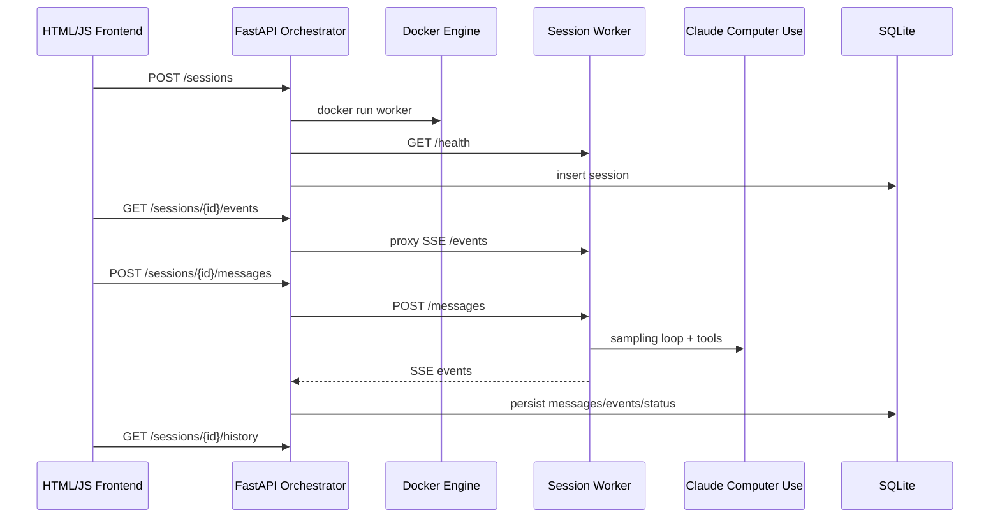

# Architecture

This project runs Claude Computer Use sessions as local backend workloads. The
core design choice is one Dockerized desktop worker per session.

## System Flow

## Components

### Frontend

The frontend in `web/` is a dependency-free demo console. It can create
sessions, send messages, open noVNC, stream live events, and reload persisted
history from SQLite.

### Orchestrator

The orchestrator in `computer_use_demo/api/main.py` owns session lifecycle,
worker creation/deletion, SSE proxying, event persistence, health checks, and
local security controls.

### Worker Manager

`computer_use_demo/api/worker_manager.py` starts and stops Docker workers. It
adds project labels, local port bindings, CPU/memory/PID limits, and runtime
environment variables.

### Worker API

`computer_use_demo/worker_api.py` runs inside each worker container. It accepts
one task at a time, calls the Claude Computer Use sampling loop, and emits SSE
events.

### Persistence

SQLite stores:

- sessions
- messages
- events
- status, errors, and completion timestamps

SQLite is intentionally local and simple. The schema is enough for debugging
and portfolio demos, not a final multi-user data model.

## Important Boundaries

- Workers are isolated by container, not by a remote sandbox service.
- Docker socket access is trusted-local only.
- Session state is partly in memory; history is persisted.
- noVNC is intended for local observation.
- Optional bearer auth protects session-scoped endpoints, but this is not a
  multi-user authorization system.

## Why This Shape

The design keeps the core orchestration problem visible: session lifecycle,
worker isolation, event streaming, and persistence. It avoids adding Redis,
Celery, Kubernetes, or a frontend build stack before those tradeoffs are needed.
